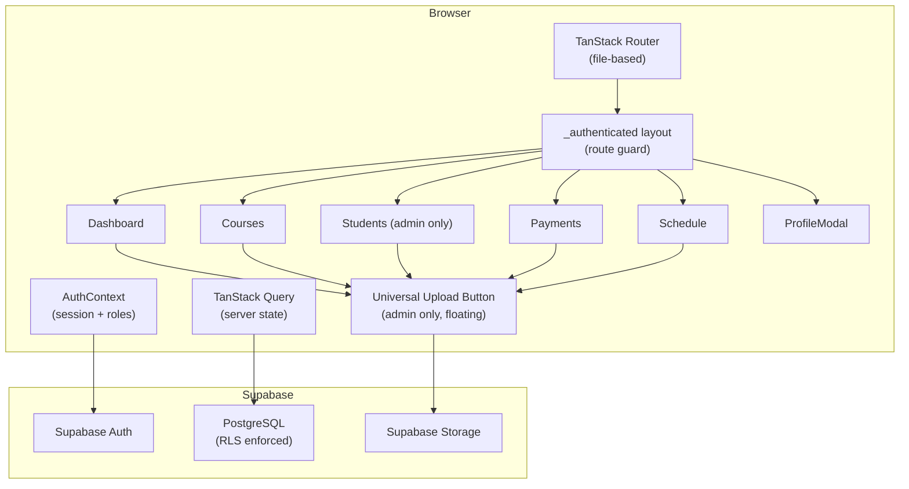

# Design Document

## Taco Driving School Management System

---

## Overview

The Taco Driving School Management System is a role-based web application built on React + TypeScript, TanStack Router (file-based routing), Supabase (auth, database, storage), Tailwind CSS, and shadcn/ui. It serves three user roles — **Admin**, **Instructor**, and **Student** — each with a distinct set of screens and capabilities.

The application already has a working skeleton: authentication, a sidebar layout, a dashboard stub, and the core Supabase schema (courses, modules, lessons, profiles, user_roles). The design below describes the full feature set that must be built on top of that foundation.

Key design goals:
- **Role isolation** — every data query and route guard enforces the user's role; no client-side trust.
- **Optimistic UI** — mutations update local state immediately and reconcile with the server response.
- **Composable forms** — all data-entry dialogs are reusable components driven by a shared form layer (react-hook-form + zod).
- **Supabase-first** — all persistence, file storage, and auth flows go through the existing Supabase client; no additional backend is introduced.

---

## Architecture

### High-Level Component Diagram



### Data Flow

1. On mount, `AuthProvider` calls `supabase.auth.getSession()` and subscribes to `onAuthStateChange`. Roles are fetched from `user_roles` and stored in context.
2. Route components use `useAuth()` to read `roles` and conditionally render admin/instructor/student views.
3. All server state (lists, counts, records) is managed by TanStack Query hooks. Mutations call Supabase directly and then invalidate the relevant query keys.
4. File uploads go to Supabase Storage; the returned public URL is written back to the relevant database record.

### Routing Structure

```
/                          → redirect to /dashboard (if authed) or /login
/login                     → LoginPage (public)
/signup                    → SignupPage (public)
/_authenticated            → AuthLayout (guard: must be authenticated)
  /dashboard               → Dashboard (all roles)
  /courses                 → CourseList (all roles)
  /courses/$courseId        → CourseDetail (all roles)
  /courses/$courseId/modules/$moduleId → ModuleDetail (all roles)
  /students                → StudentList (admin only)
  /payments                → PaymentList (all roles, filtered by role)
  /schedule                → ScheduleView (all roles, filtered by role)
```

---

## Components and Interfaces

### Shared / Layout

**`AuthLayout` (`_authenticated.tsx`)** — already exists. Renders sidebar, mobile nav, and `<Outlet>`. Redirects to `/login` if unauthenticated.

**`UniversalUploadButton`** — floating action button rendered inside `AuthLayout` for admin users only. Accepts a `context` prop (`'students' | 'payments' | 'courses' | 'schedule'`) derived from the current route. Renders a `+` button that opens the context-appropriate dialog.

```typescript
interface UniversalUploadButtonProps {
  context: 'students' | 'payments' | 'courses' | 'schedule' | 'default';
}
```

**`ProfileModal`** — dialog triggered from the Account tab / sidebar user card. Glassmorphism overlay. Contains tabs: Profile, Settings, (Logout button).

### Course Management

**`CourseList`** — grid of `CourseCard` components. Admin sees all non-archived courses plus an archive toggle. Students see only enrolled courses.

**`CourseCard`** — displays title, category, module count. Admin sees Edit + Archive icons. All roles see a View icon.

**`CourseForm`** — react-hook-form dialog for creating/editing a course. Fields: `title` (required), `description`, `category`.

**`ModuleList`** — ordered list of modules within a course. Supports drag-to-reorder (admin only) via a position update mutation.

**`ModuleForm`** — dialog for creating/editing a module. Fields: `title`, `description`, `position` (auto-assigned).

**`LessonList`** — ordered list of lessons within a module. Supports drag-to-reorder (admin only).

**`LessonForm`** — dialog for creating/editing a lesson. Fields: `title`, `body`, `lesson_type` (theory/practical), `content_type` (text/video/pdf), file upload (for video/pdf).

**`LessonViewer`** — renders lesson content based on `content_type`:
- `text` → rich text / markdown render
- `video` → `<video>` element or embedded iframe
- `pdf` → `<iframe>` or `<embed>` with a download fallback

**`ProgressButton`** — button on each lesson that marks it complete. Calls upsert on `lesson_progress`.

### Student Management

**`StudentList`** — searchable, filterable table of students (admin only). Columns: name, email, enrolled course, enrollment status.

**`EnrollStudentForm`** — multi-step dialog: (1) enter name + email → creates Supabase Auth user + profile + student role; (2) assign to a course → creates enrollment record.

**`StudentDetail`** — admin view of a single student: profile info, enrolled course, payment history, uploaded documents.

### Payment Management

**`PaymentList`** — table of payments. Admin sees all; students see only their own. Overdue rows are highlighted.

**`PaymentForm`** — dialog for creating/editing a payment. Fields: `student_id` (admin only), `amount`, `due_date`, `status`, file upload for proof.

**`ReceiptDownload`** — button that generates a simple HTML-to-PDF receipt (using browser print or a lightweight library) for paid payments.

### Schedule Management

**`ScheduleView`** — calendar or list view of schedule entries. Admin sees all; instructors and students see only their own.

**`ScheduleEntryForm`** — dialog for creating/editing a schedule entry. Fields: `instructor_id`, `module_id`, `student_id` (optional), `date`, `start_time`, `end_time`. Performs client-side conflict check before submission.

**`ConflictWarning`** — inline alert shown when a new entry overlaps an existing one for the same instructor.

### Dashboard

**`AdminDashboard`** — stat cards (total students, active courses, pending payments, upcoming schedule entries in next 7 days) + Quick Add shortcuts.

**`StudentDashboard`** — completion percentage progress bar + countdown to next scheduled lesson.

### Hooks

| Hook | Purpose |
|---|---|
| `useCourses()` | Fetch courses (filtered by enrollment for students) |
| `useModules(courseId)` | Fetch modules for a course |
| `useLessons(moduleId)` | Fetch lessons for a module |
| `useEnrollments(userId?)` | Fetch enrollments |
| `useStudents(search?, filter?)` | Fetch students with optional search/filter |
| `usePayments(userId?)` | Fetch payments (scoped by role) |
| `useScheduleEntries(userId?, role?)` | Fetch schedule entries (scoped by role) |
| `useLessonProgress(userId, courseId)` | Fetch progress records for completion % |
| `useProfile(userId)` | Fetch and mutate profile |

All hooks use TanStack Query with appropriate `queryKey` arrays for cache invalidation.

---

## Data Models

The existing Supabase schema covers most of the domain. The following tables need to be **added via new migrations**:

### `enrollments` (new migration)

```sql
create table public.enrollments (
  id uuid primary key default gen_random_uuid(),
  user_id uuid not null references auth.users(id) on delete cascade,
  course_id uuid not null references public.courses(id) on delete cascade,
  enrolled_at timestamptz not null default now(),
  status text not null default 'active' check (status in ('active', 'completed', 'withdrawn')),
  unique (user_id, course_id)
);
alter table public.enrollments enable row level security;

-- Students see their own; admins see all
create policy "Students view own enrollments" on public.enrollments
  for select to authenticated using (user_id = auth.uid() or public.has_role(auth.uid(), 'admin'));
create policy "Admins manage enrollments" on public.enrollments
  for all to authenticated using (public.has_role(auth.uid(), 'admin'))
  with check (public.has_role(auth.uid(), 'admin'));
```

### `payments` (new migration)

```sql
create type public.payment_status as enum ('pending', 'paid', 'overdue');

create table public.payments (
  id uuid primary key default gen_random_uuid(),
  user_id uuid not null references auth.users(id) on delete cascade,
  amount numeric(10,2) not null,
  due_date date not null,
  status public.payment_status not null default 'pending',
  proof_url text,
  created_at timestamptz not null default now(),
  updated_at timestamptz not null default now()
);
alter table public.payments enable row level security;
create trigger payments_updated_at before update on public.payments
  for each row execute function public.set_updated_at();

create policy "Students view own payments" on public.payments
  for select to authenticated using (user_id = auth.uid() or public.has_role(auth.uid(), 'admin'));
create policy "Admins manage payments" on public.payments
  for all to authenticated using (public.has_role(auth.uid(), 'admin'))
  with check (public.has_role(auth.uid(), 'admin'));
```

### `schedule_entries` (new migration)

```sql
create table public.schedule_entries (
  id uuid primary key default gen_random_uuid(),
  instructor_id uuid not null references auth.users(id) on delete cascade,
  module_id uuid references public.modules(id) on delete set null,
  student_id uuid references auth.users(id) on delete set null,
  scheduled_date date not null,
  start_time time not null,
  end_time time not null,
  created_at timestamptz not null default now(),
  updated_at timestamptz not null default now(),
  check (end_time > start_time)
);
alter table public.schedule_entries enable row level security;
create trigger schedule_entries_updated_at before update on public.schedule_entries
  for each row execute function public.set_updated_at();

create policy "Users view relevant schedule entries" on public.schedule_entries
  for select to authenticated using (
    instructor_id = auth.uid() or
    student_id = auth.uid() or
    public.has_role(auth.uid(), 'admin')
  );
create policy "Admins manage schedule entries" on public.schedule_entries
  for all to authenticated using (public.has_role(auth.uid(), 'admin'))
  with check (public.has_role(auth.uid(), 'admin'));
```

### `lesson_progress` (new migration)

```sql
create table public.lesson_progress (
  id uuid primary key default gen_random_uuid(),
  user_id uuid not null references auth.users(id) on delete cascade,
  lesson_id uuid not null references public.lessons(id) on delete cascade,
  completed boolean not null default false,
  completed_at timestamptz,
  created_at timestamptz not null default now(),
  updated_at timestamptz not null default now(),
  unique (user_id, lesson_id)
);
alter table public.lesson_progress enable row level security;
create trigger lesson_progress_updated_at before update on public.lesson_progress
  for each row execute function public.set_updated_at();

create policy "Students manage own progress" on public.lesson_progress
  for all to authenticated using (user_id = auth.uid() or public.has_role(auth.uid(), 'admin'))
  with check (user_id = auth.uid() or public.has_role(auth.uid(), 'admin'));
```

### `notification_preferences` (new migration)

```sql
create table public.notification_preferences (
  user_id uuid primary key references auth.users(id) on delete cascade,
  email_reminders boolean not null default true,
  updated_at timestamptz not null default now()
);
alter table public.notification_preferences enable row level security;
create trigger notification_preferences_updated_at before update on public.notification_preferences
  for each row execute function public.set_updated_at();

create policy "Users manage own preferences" on public.notification_preferences
  for all to authenticated using (user_id = auth.uid())
  with check (user_id = auth.uid());
```

### TypeScript Types (additions to `src/integrations/supabase/types.ts`)

The Supabase types file will need to be regenerated after migrations run. Key domain types used in components:

```typescript
// src/types/domain.ts
export type PaymentStatus = 'pending' | 'paid' | 'overdue';
export type EnrollmentStatus = 'active' | 'completed' | 'withdrawn';
export type LessonType = 'theory' | 'practical';
export type LessonContentType = 'text' | 'video' | 'pdf';
export type AppRole = 'admin' | 'instructor' | 'student';

export interface CompletionStats {
  completedLessons: number;
  totalLessons: number;
  percentage: number;
}

export interface ScheduleConflict {
  conflictingEntryId: string;
  instructorId: string;
  date: string;
  startTime: string;
  endTime: string;
}
```

---

## Correctness Properties

*A property is a characteristic or behavior that should hold true across all valid executions of a system — essentially, a formal statement about what the system should do. Properties serve as the bridge between human-readable specifications and machine-verifiable correctness guarantees.*

This feature contains significant pure logic (access control decisions, position calculations, date arithmetic, percentage calculations, conflict detection) that is well-suited to property-based testing. The PBT library used is **fast-check** (already compatible with Vitest).

### Property 1: Route access control is consistent with the permission matrix

*For any* combination of route path and user role, the `canAccess(route, role)` function SHALL return `true` if and only if the role is in the allowed set for that route, and `false` otherwise — with no role ever gaining access to a route not in its permission matrix.

**Validates: Requirements 1.4, 4.7**

### Property 2: Universal Upload Button default action matches current route

*For any* admin route path, the `getUploadButtonContext(pathname)` function SHALL return the action label that corresponds to that route section — and for any two distinct route sections, the returned action labels SHALL be distinct.

**Validates: Requirements 2.2, 2.3, 2.4, 2.5**

### Property 3: New item position is always one greater than the current maximum

*For any* non-empty ordered list of modules (or lessons) within a parent, adding a new item SHALL assign it a `position` value equal to `max(existing positions) + 1`. For an empty list, the first item SHALL receive `position = 0`.

**Validates: Requirements 3.2, 3.3**

### Property 4: Reorder produces a contiguous, duplicate-free position sequence

*For any* ordered list of items and any valid move operation (moving item at index `i` to index `j`), the resulting `position` values SHALL form a contiguous integer sequence starting at `0` with no duplicates and the same number of items as before.

**Validates: Requirements 3.8**

### Property 5: Students only see courses they are enrolled in

*For any* student user and any set of courses in the database, the `filterCoursesForStudent(courses, enrollments, userId)` function SHALL return only the courses whose IDs appear in the student's enrollment records — never more, never fewer.

**Validates: Requirements 5.1, 5.6**

### Property 6: Course completion percentage is mathematically correct and bounded

*For any* non-negative integer `completedLessons` and positive integer `totalLessons` where `completedLessons ≤ totalLessons`, the `calculateCompletionPercentage(completed, total)` function SHALL return a value equal to `Math.round((completed / total) * 100)`, always in the range `[0, 100]`.

**Validates: Requirements 5.3, 8.4**

### Property 7: Students are denied access to non-enrolled courses

*For any* student and any course ID not present in that student's enrollment records, the `checkCourseAccess(userId, courseId, enrollments)` function SHALL return `false`.

**Validates: Requirements 5.6**

*Note: Property 5 and Property 7 are complementary — Property 5 tests the positive case (enrolled courses are shown), Property 7 tests the negative case (non-enrolled courses are blocked). Both are retained.*

### Property 8: Students only see their own payment records

*For any* student user ID and any list of payment records, the `filterPaymentsForUser(payments, userId)` function SHALL return only the records where `payment.user_id === userId`.

**Validates: Requirements 6.4**

### Property 9: Generated receipt contains all required fields

*For any* payment record with `status = 'paid'`, the `generateReceiptContent(payment, studentName)` function SHALL produce a string that contains the payment amount, the payment date, and the student's name.

**Validates: Requirements 6.5**

### Property 10: Overdue detection is correct for all date/status combinations

*For any* payment record, `isOverdue(payment, now)` SHALL return `true` if and only if `payment.due_date < now` AND `payment.status === 'pending'`. For all other combinations, it SHALL return `false`.

**Validates: Requirements 6.6**

### Property 11: Schedule conflict detection correctly identifies all overlapping intervals

*For any* two schedule entries for the same instructor on the same date, `hasScheduleConflict(entryA, entryB)` SHALL return `true` if and only if the time intervals `[startA, endA)` and `[startB, endB)` overlap (i.e., `startA < endB && startB < endA`). For non-overlapping intervals, it SHALL return `false`.

**Validates: Requirements 7.2**

### Property 12: Schedule entries are filtered to the requesting user

*For any* user (student or instructor) and any list of schedule entries, the `filterScheduleForUser(entries, userId, role)` function SHALL return only the entries where `entry.student_id === userId` (for students) or `entry.instructor_id === userId` (for instructors). Admin users SHALL receive all entries unfiltered.

**Validates: Requirements 7.3, 7.4**

### Property 13: Next lesson calculation returns the nearest future entry

*For any* list of schedule entries and a reference timestamp `now`, the `getNextLesson(entries, now)` function SHALL return the entry with the smallest `scheduledDate + startTime` value that is strictly greater than `now`. If no future entries exist, it SHALL return `null`.

**Validates: Requirements 8.3**

---

## Error Handling

### Authentication Errors

- Supabase auth errors are caught in the login form's submit handler. The raw Supabase error message is displayed via `toast.error()`. The message must not reveal whether the email or password was the incorrect field — use a generic "Invalid credentials" fallback if the Supabase message is too specific.
- Session expiry is handled by `onAuthStateChange`; the user is redirected to `/login` automatically.

### Route Guard Errors

- The `_authenticated` layout redirects to `/login` if `!isAuthenticated` after loading completes.
- Role-restricted routes (e.g., `/students` for non-admins) render a 403 message component rather than redirecting, so the user understands why they cannot access the page.

### Data Mutation Errors

- All Supabase mutations check the returned `error` object. On error, `toast.error(error.message)` is shown and the optimistic update is rolled back via TanStack Query's `onError` callback.
- File upload failures show a specific toast and do not update the `content_url` / `proof_url` / `avatar_url` field.

### Schedule Conflict

- Before submitting a new schedule entry, the client queries existing entries for the instructor on the same date. If a conflict is detected, a `ConflictWarning` alert is shown inline. The admin can choose to confirm (proceed anyway) or cancel.

### Form Validation

- All forms use zod schemas for client-side validation. Required fields, minimum lengths, valid enum values, and date ordering (`end_time > start_time`) are enforced before any Supabase call is made.
- Server-side RLS errors (e.g., attempting to insert a record the user is not authorized to create) surface as toast errors.

### File Upload Constraints

- Maximum file size: 10 MB (enforced client-side before upload).
- Allowed MIME types per context: images (`image/*`) for avatars and identity documents; `application/pdf` for lesson PDFs and payment proofs; `video/*` for lesson videos.
- Violations show an inline validation error on the file input.

---

## Testing Strategy

### Unit Tests (Vitest)

Unit tests cover pure functions and component rendering with concrete examples:

- `canAccess(route, role)` — permission matrix correctness for each role/route pair
- `getUploadButtonContext(pathname)` — correct action label per route
- `calculateCompletionPercentage(completed, total)` — boundary values (0/0 edge case, 100%)
- `isOverdue(payment, now)` — specific date/status combinations
- `hasScheduleConflict(a, b)` — adjacent, overlapping, and contained intervals
- `getNextLesson(entries, now)` — empty list, single entry, multiple entries
- `generateReceiptContent(payment, name)` — verifies required fields are present
- Component rendering: `LessonViewer` renders correct element per `content_type`; `ConflictWarning` renders when conflict exists; `ProgressButton` shows correct state

### Property-Based Tests (Vitest + fast-check)

Each correctness property from the design document is implemented as a single property-based test with a minimum of 100 iterations. Tests are tagged with a comment referencing the property:

```typescript
// Feature: taco-driving-school, Property 6: Course completion percentage is mathematically correct and bounded
test('completion percentage is always in [0,100] and mathematically correct', () => {
  fc.assert(
    fc.property(
      fc.integer({ min: 0, max: 1000 }),
      fc.integer({ min: 1, max: 1000 }),
      (completed, total) => {
        fc.pre(completed <= total);
        const result = calculateCompletionPercentage(completed, total);
        return result >= 0 && result <= 100 &&
               result === Math.round((completed / total) * 100);
      }
    ),
    { numRuns: 100 }
  );
});
```

Properties to implement as PBT:
- **Property 1**: Route access control (generate random route/role pairs)
- **Property 2**: Upload button context (generate random admin route paths)
- **Property 3**: New item position assignment (generate random position lists)
- **Property 4**: Reorder produces contiguous positions (generate lists + move operations)
- **Property 5**: Student course filter (generate enrollment sets and course lists)
- **Property 6**: Completion percentage (generate completed/total pairs)
- **Property 7**: Non-enrolled course access denied (generate student + course sets)
- **Property 8**: Payment filter by user (generate payment lists with mixed user IDs)
- **Property 9**: Receipt contains required fields (generate paid payment records)
- **Property 10**: Overdue detection (generate date/status combinations)
- **Property 11**: Schedule conflict detection (generate time interval pairs)
- **Property 12**: Schedule filter by user/role (generate entry lists with mixed IDs)
- **Property 13**: Next lesson calculation (generate schedule entry sets with timestamps)

### Integration Tests

Integration tests use the Supabase local emulator (`supabase start`) and verify:

- Enrollment creation: admin creates user → profile exists, student role assigned, enrollment record created
- File upload: file uploaded to storage bucket → URL written to correct record field
- RLS enforcement: student cannot read another student's payments (direct Supabase client call returns empty)
- Admin aggregate counts: dashboard stats match actual row counts

### Test File Structure

```
src/
  __tests__/
    unit/
      access-control.test.ts
      completion-percentage.test.ts
      schedule-conflict.test.ts
      overdue-detection.test.ts
      receipt-generation.test.ts
      position-assignment.test.ts
      next-lesson.test.ts
    property/
      access-control.property.test.ts
      upload-button-context.property.test.ts
      position-assignment.property.test.ts
      reorder-positions.property.test.ts
      course-filter.property.test.ts
      completion-percentage.property.test.ts
      payment-filter.property.test.ts
      receipt-completeness.property.test.ts
      overdue-detection.property.test.ts
      schedule-conflict.property.test.ts
      schedule-filter.property.test.ts
      next-lesson.property.test.ts
    integration/
      enrollment.integration.test.ts
      file-upload.integration.test.ts
      rls.integration.test.ts
```
